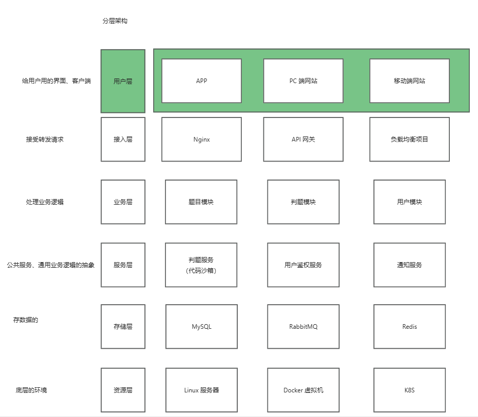
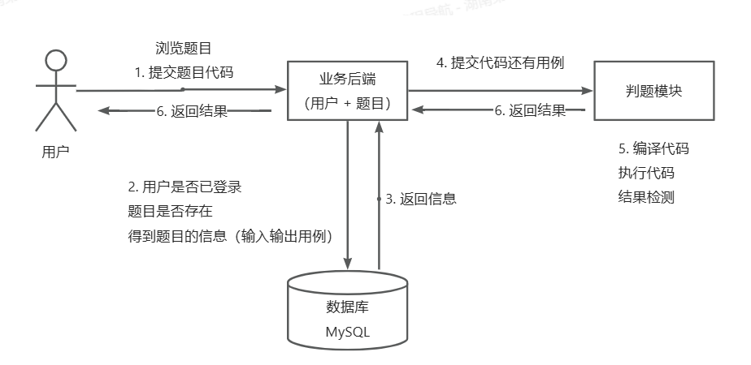
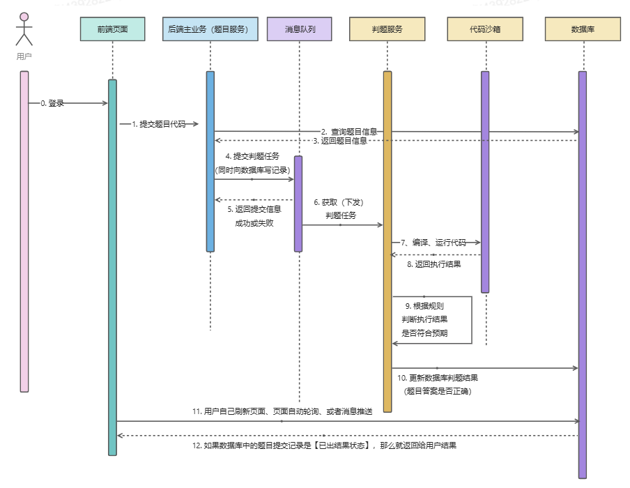

# noj在线判题系统微服务版本

改造前的springboot版：https://github.com/Lynlove/noj-backend

## 系统架构图

## 功能模块
1. 题目模块
    - 创建题目（管理员）
    - 删除题目（管理员）
    - 修改题目（管理员）
    - 搜索题目（用户）
    - 在线做题
    - 提交题目代码
2. 用户模块
    - 注册
    - 登录
3. 判题模块
    - 提交判题（结果是否正确）
    - 错误处理（内存溢出、安全性、超时）
    - 自主实现代码沙箱（安全沙箱）
    - 开放接口（提供一个独立的新服务）

## 核心业务流程

